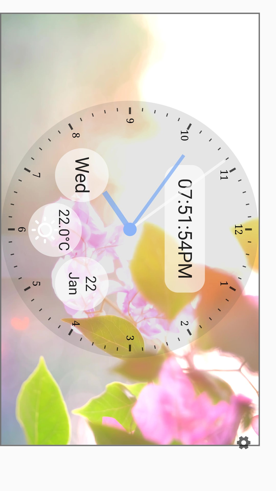
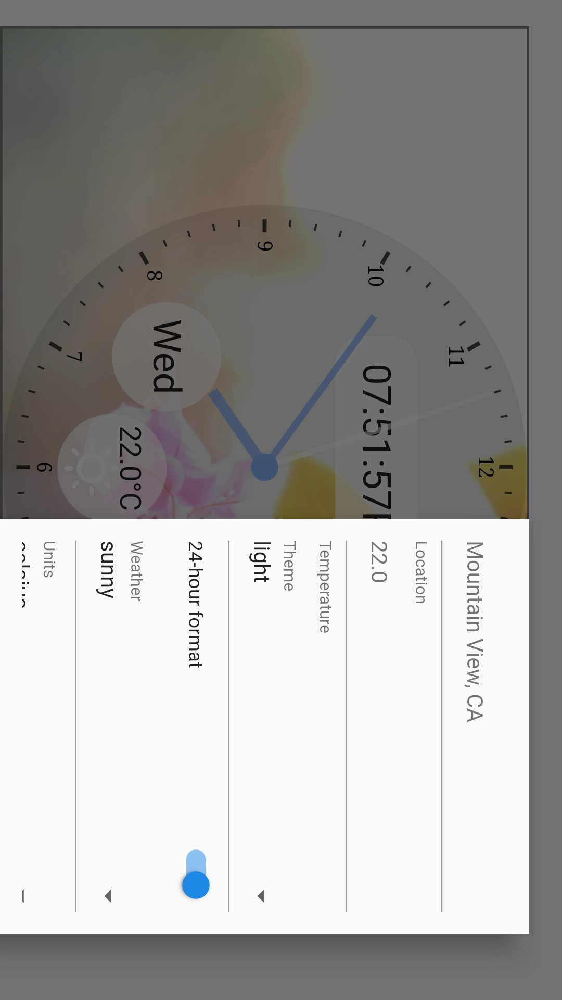
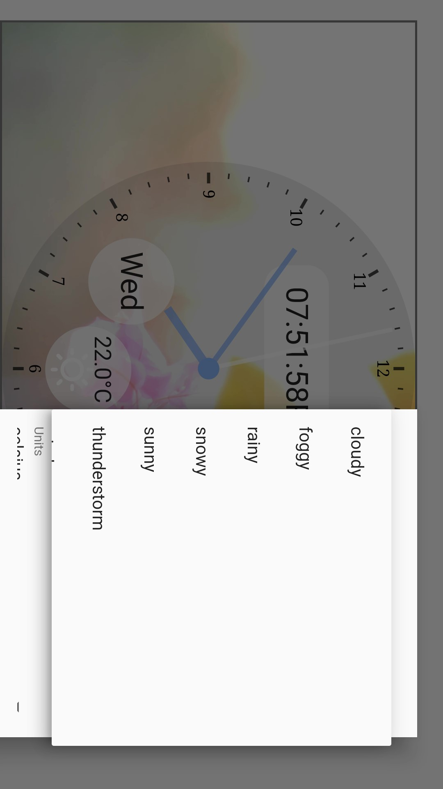
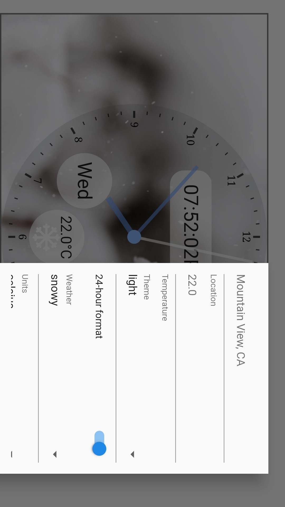
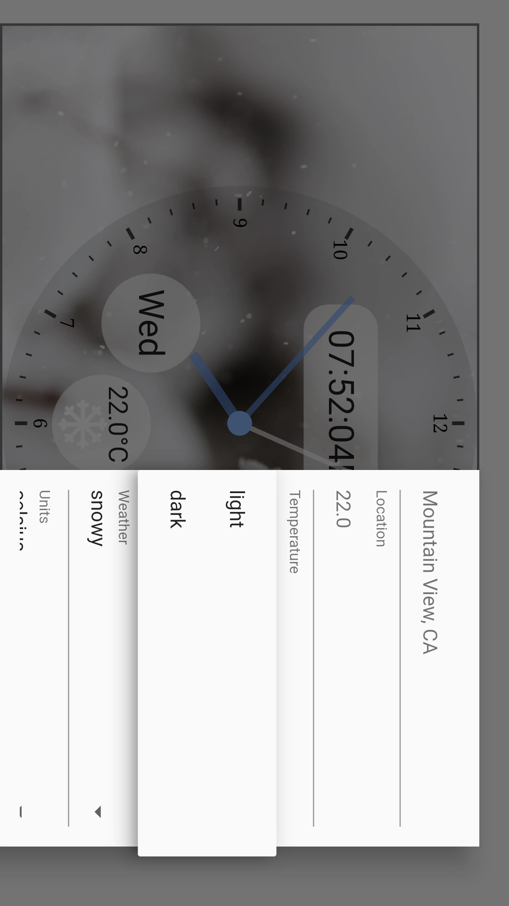
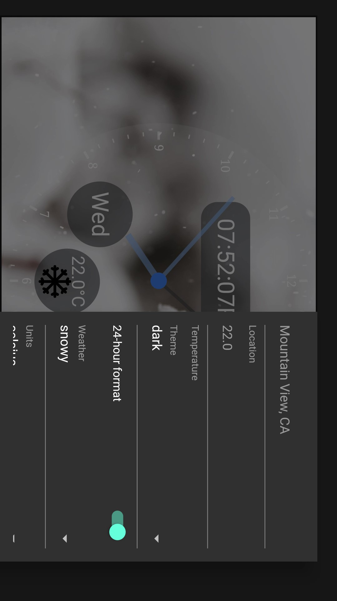
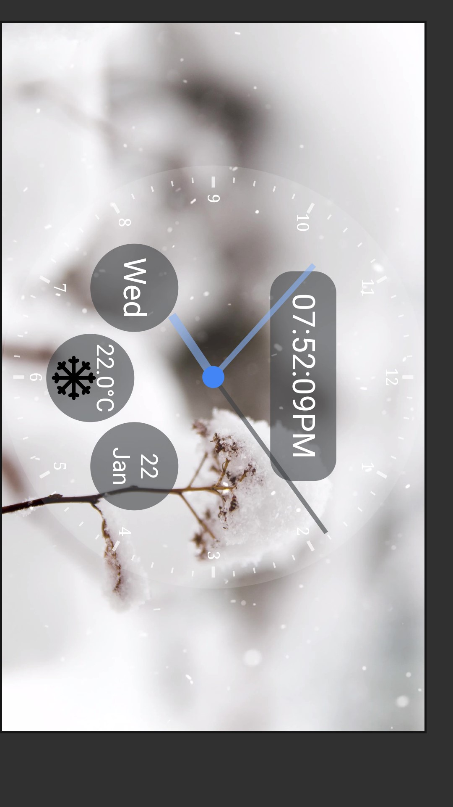

# Flutter Clock

Welcome to Flutter Clock!

This is my first Flutter application doing it by participating in the Flutter Clock Challenge
<video  style="display:block; width:100%; height:auto;" autoplay controls loop="loop">
       <source src="shady_clock/Flutter_Clock.mp4" type="video/mp4" />
</video>

-----------------------------------------------------------

See [flutter.dev/clock](https://flutter.dev/clock) for how to get started, submission requirements, contest rules, and FAQs.

See a [live demo](https://maryx.github.io/flutter_clock) with Flutter for Web!

Example [Analog Clock](analog_clock)

Example [Digital Clock](digital_clock)

